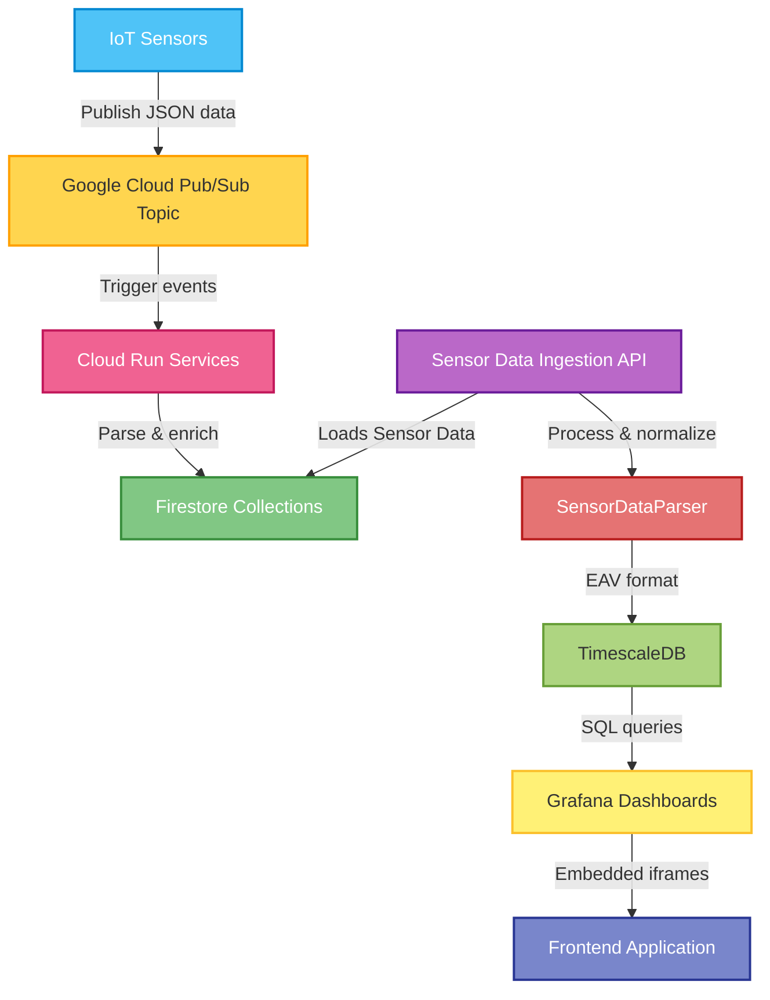

# Functional Specification - Sensor Data Visualization Application

# Table of Contents
1. [Introduction](#1-introduction)
2. [Glossary](#2-glossary)
3. [Use Cases / Overview](#3-use-cases--overview)
4. [User Requirements](#4-user-requirements)
5. [System Architecture](#5-system-architecture)
6. [System Requirements](#6-system-requirements)
   * [Functional Requirements](#61-functional-requirements)
   * [Non-Functional Requirements](#62-non-functional-requirements)
7. [Flowchart](#7-flowchart)

# 1. Introduction

The primary purpose of the application is to facilitate the monitoring of environmental projects by displaying time-series sensor data and comprehensive statistics. The platform serves two main user roles:

Administrators: Can manage the system by adding, removing, and configuring sensors. This includes defining data mapping logic to ensure raw sensor inputs are correctly transformed into meaningful environmental metrics.

Users/Researchers: Can monitor environmental conditions through dynamic visualizations. The system provides tools for analyzing trends, comparing variables, viewing statistical summaries (such as averages and medians), and examining historical data over custom time periods.

The product is a web application hosted at envidata.metropolia.fi.

# 2. Glossary

- **VM / Virtual Machine** – A virtual machine where the backend of the project is run.  
- **Firestore** – A cloud database service used to store sensor data.  
- **SensorID** – An identifier used to distinguish sensors.  
- **TimescaleDB** – A time-series database optimized for timestamped data.  
- **Grafana** – A platform used for sensor data visualization.  

# 3. Use Cases / Overview

The application is a cloud-native platform accessible via **envidata.metropolia.fi**. Security is managed through a **Request Access** authentication system, where users must be authorized to access the environmental data and management tools.

### Initial Discovery & Configuration
When a new sensor is deployed, it automatically begins publishing data to the system. If the sensor's unique ID (MAC address) is not yet recognized, the system routes the data to an **"Unconfigured Sensors"** list. This allows administrators to "discover" new hardware without manual database entries. From the management panel, an admin can then:
* Assign the sensor to a specific **Project**.
* Define the **Data Logic & Mapping** (e.g., mapping raw key `t` to the metric `temperature`).
* Set the geographical coordinates for the map view.

### Automated Backfilling
Once a sensor is configured, the system automatically triggers a **Backfill** process. This logic moves all historical readings that were temporarily stored as "unknown" into the correct project-specific collections, ensuring no data is lost during the setup phase.

### Dynamic Data Visualization
The core value of the application is its ability to handle any environmental metric without code changes. 
* **Map View:** The homepage provides a geographic overview of all active sensors. Filtering by SensorID or Project helps users locate specific nodes quickly.
* **Sensor Detail View:** Clicking a sensor opens a specialized view where **Grafana dashboards are rendered dynamically**. The system identifies all mapped metrics (e.g., soil moisture, EC, temperature) and generates real-time graphs for each.
* **Statistical Analysis:** Users can select custom time ranges to view calculated statistics, including **averages, medians, and standard deviations** for every available metric.

### Data Management
The application provides clear visual feedback for most operations. A **green notification** confirms successful sensor updates or backfills, while **red alerts** signal configuration errors or invalid mapping logic.
# 4. User Requirements

User requirements for the project are as follows:

- View sensors visually on a map  
- Add and remove sensors  
- A user interface that is easy to use  
- Support for multiple sensor types  
- Visualize sensor data using graphs and dashboards  
- Export sensor values to a CSV file  

# 5. System Architecture

The components are: **IoT Sensors, Google Cloud Pub/Sub, Eventarc, Cloud Run, Firestore, Python API (FastAPI), and React Frontend with Integrated Grafana.**

### Data Ingestion Pipeline
1. **IoT Sensors:** Physical devices (e.g., TEROS 12, RuuviTag) publish raw JSON data to a specific **Google Cloud Pub/Sub Topic**.
2. **Eventarc Trigger:** An Eventarc trigger listens to the Pub/Sub topic and automatically invokes the **Cloud Run** processing service for every incoming message.
3. **Cloud Run (Processor):** This service acts as the central logic hub. It:
    * Performs a lookup from **Firestore** to find the sensor's configuration (Project ID and Mapping).
    * If the sensor is unknown, it routes the raw data to the `unconfigured_sensors` collection.
    * If configured, it applies the mapping logic to transform raw keys into standardized metrics.
    * Forwards the normalized data to **TimescaleDB** for long-term storage and **Firestore** for real-time status.

### Data Storage
* **Firestore:** Acts as the "Source of Truth" for system metadata, sensor configurations, and temporary storage for unconfigured sensor readings.
* **TimescaleDB:** A PostgreSQL-based time-series database that stores all historical measurements in an EAV (Entity-Attribute-Value) or relational format, optimized for analytical queries.

### Backend & Frontend Communication
* **Python API:** A FastAPI-based backend that handles administrative tasks such as adding, updating, and deleting sensor configurations in SQL and Firestore. It also manages the **Backfill** trigger logic.
* **React Frontend:** The user interface hosted at **envidata.metropolia.fi**. It communicates with the Python API to manage sensors and fetch metadata.
* **Dynamic Grafana Integration:** Instead of static charts, the frontend embeds **Grafana Dashboards** via iframes. These dashboards query TimescaleDB dynamically, automatically rendering graphs for whatever metrics are defined in the sensor's mapping.

### Authentication & Security
Access is restricted via a **Request Access** authentication layer. API communication is secured using Google Cloud Service Accounts and IAM roles, ensuring that only authorized services can write to the databases.

# 6. System Requirements

### 6.1 Functional Requirements

* **Role-Based Access Control (RBAC):** * **Users:** Can view the sensor map, browse projects, and inspect dynamic data visualizations and statistics. 
    * **Administrators:** Have exclusive access to management views to add, update, and delete sensors, as well as configure data mappings.
* **Sensor Management (Admin only):** The system allows admins to search for, delete, and edit existing sensors or configure unknown devices.
* **Dynamic Mapping (Admin only):** Admins can define how raw JSON keys from sensors are mapped to human-readable metrics.
* **Automated Discovery:** The system automatically captures data from unconfigured sensors and displays them in a dedicated "Unknown Sensors" list for admins to onboard.
* **Data Recovery (Admin only):** Supports a **Backfill** function to re-process historical data after a sensor's configuration is updated.
* **Visualization (All Users):** Provides comprehensive visualization of sensor data through dynamically generated dashboards and graphs.
* **Data Export (All Users):** Supports exporting sensor readings to CSV files for external analysis.

### 6.2 Non-Functional Requirements

* **Usability:** The interface is designed to be intuitive. Administrative tools are hidden from standard users to simplify the experience. Clear visual feedback (green/red) is provided for all actions.
* **Architecture:** The system uses a **Hybrid Cloud** approach. Real-time data ingestion and processing are handled by serverless Google Cloud services (Cloud Run), while the web application and API are hosted as Docker containers on Metropolia’s internal virtual servers.
* **Reliability:** The ingestion pipeline uses **Pub/Sub** to ensure messages are queued and processed reliably. Data consistency is maintained across Firestore and TimescaleDB.
* **Security:** Hosted at **envidata.metropolia.fi**. Access is restricted via a **Request Access** authentication model. Administrative functions are further protected by role-specific permissions.
* **Maintainability:** The frontend and backend are containerized, ensuring consistent deployment.

# 7. Flowchart

