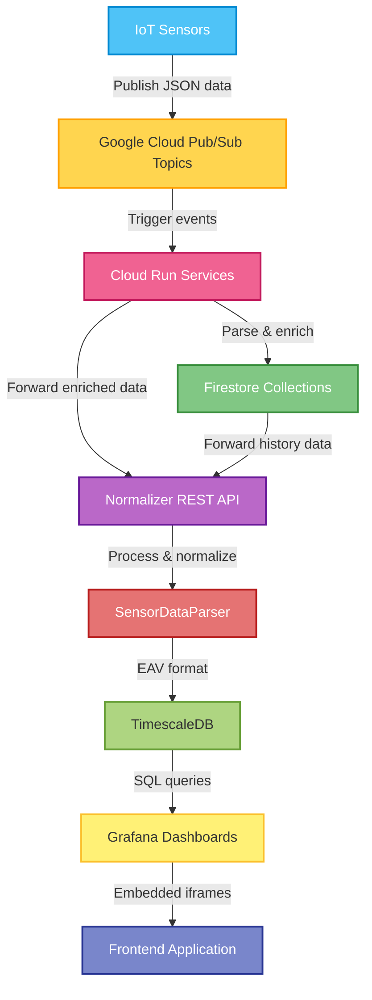

## 6. System Requirements

### 6.1 Functional Requirements

The system allows users to add sensors with coordinates, as well as search for, delete, and edit existing sensors. It provides comprehensive visualization of sensor data through dashboards, gauges, and graphs, enabling users to easily interpret and monitor sensor readings. Additionally, the system supports exporting data to CSV files, making it convenient to analyze the information further in tools such as Excel.

### 6.2 Non-Functional Requirements

The system was implemented with a clear and user-friendly interface, ensuring that even new users can navigate it easily. Navigation is logical, and essential features can be found without difficulty. The map view and the sensor table beneath it refresh quickly, and sensor visualizations are presented clearly on dashboards without requiring technical expertise.

The system was designed to be reliable by properly handling error situations and displaying clear error messages to the user. Data stored in TimescaleDB remains consistent and intact even in the event of errors.

Security was ensured by requiring the backend to use a Google Cloud Run API key, and access to the system is restricted to VPN connections using Metropolia credentials. Invalid API calls are rejected to prevent misuse.

Maintainability was achieved by keeping the frontend and backend as separate components, allowing them to be updated independently. Key parts of the codebase are documented.

The system was implemented as a browser-based application so it can be used without local installations. The application is compatible with major browsers such as Chrome and Firefox, and functions consistently across different workstation environments.

### 7. Flowchart

