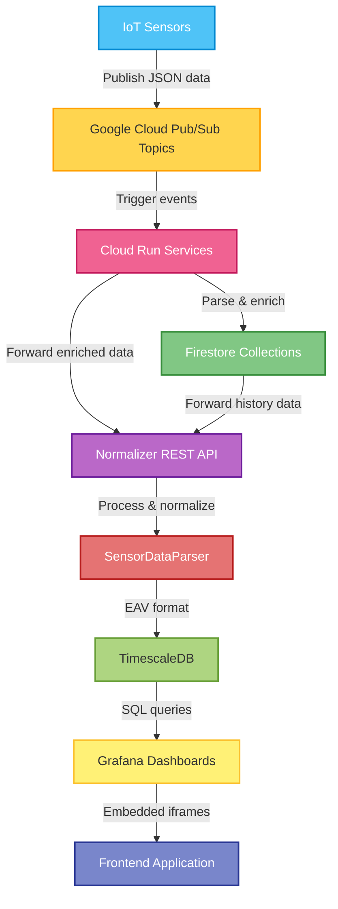

# 1. Introduction

The purpose of the application is to view sensor values and allow the user to add and remove sensors. Sensors are visualized on a map, and the data they produce is displayed using various metrics such as average and median. Graphs are also created from the data, making it easy to examine values collected over a selected time period. The product is a web-based application.

# 2. Glossary

- **VM / Virtual Machine** – A virtual machine where the backend of the project is run.  
- **Firestore** – A cloud database service used to store sensor data.  
- **SensorID** – An identifier used to distinguish sensors.  
- **TimescaleDB** – A time-series database optimized for timestamped data.  
- **Grafana** – A platform used for sensor data visualization.  

# 3. Use Cases / Overview

The application runs on a Virtual Machine (VM) on the client’s computer. The program requires both the frontend and backend to be running. Once these are active, the user can open a browser and go to the website. The VM is accessed via a VPN connection. The VPN requires logging in with Metropolia credentials.

The application is used to visualize sensor data and provides multiple ways to review the information received from sensors. The homepage features a map showing sensor locations, along with a list of sensors displayed under the map. On the left side of the map, a panel allows users to add or delete sensors. Above the map, the *“Load history”* button retrieves historical sensor data from the database. A search field for SensorID is located in the upper-right corner of the page. Entering a string filters the sensor list below the map to show only sensors whose ID contains the entered characters, helping users find sensors easily.

Clicking a sensor in the list navigates the user to a detailed view showing the sensor’s historical temperature and humidity changes as graphs. This is a sensor-specific view. The most recently received temperature or humidity value is shown to the right of the graphs. Users can also choose which time range they want to view by selecting a timespan above the latest temperature reading. In this view, it is also possible to switch to another sensor by choosing a different SensorID above the temperature graph.

In the center of the website’s navigation bar is the *“Sensors”* section, which leads to the general sensor overview. In this overview, the user first selects the category of sensors they want to inspect. After selecting a category, SensorID-based filtering is available. Once a category is selected, temperature, humidity, and—if available—air pressure data is displayed, each with its own graph for the chosen time range. Below the graphs is a dashboard showing the median, average, standard deviation, and latest measurement for each metric. Under the dashboard is a table listing the collected sensor data, and at the bottom is the database information from which the data was retrieved.

# 4. User Requirements

User requirements for the project are as follows:

- View sensors visually on a map  
- Add and remove sensors  
- A user interface that is easy to use  
- Support for multiple sensor types  
- Visualize sensor data using graphs and dashboards  
- Export sensor values to a CSV file  

# 5. System Architecture

The system components are: Sensor, Firestore, Google Cloud Run, Backend, and Frontend.

The sensor is configured to send data to Firestore. Firestore is a cloud database where the received data is stored. Google Cloud Run uses this service, and a dedicated Cloud Run function fetches the required data from Firestore and forwards it to the backend.

For the backend to communicate with Cloud Run, Cloud Run user credentials (in JSON format) are required. These credentials are stored in the root of the backend’s Docker directory.

Incoming data is processed in the backend and normalized into the desired format. After processing, the data is stored in the TimescaleDB database, which is optimal for timestamped data. The stored information is accessed via an API called **Normalizer-API**, which defines the endpoints used by the frontend.

The frontend sends requests to the backend, enabling data communication between the backend and frontend.

# 6. System Requirements

### 6.1 Functional Requirements

The system allows users to add sensors with coordinates, as well as search for, delete, and edit existing sensors. It provides comprehensive visualization of sensor data through dashboards, gauges, and graphs, enabling users to easily interpret and monitor sensor readings. Additionally, the system supports exporting data to CSV files, making it convenient to analyze the information further in tools such as Excel.

### 6.2 Non-Functional Requirements

The system was implemented with a clear and user-friendly interface, ensuring that even new users can navigate it easily. Navigation is logical, and essential features can be found without difficulty. The map view and the sensor table beneath it refresh quickly, and sensor visualizations are presented clearly on dashboards without requiring technical expertise.

The system was designed to be reliable by properly handling error situations and displaying clear error messages to the user. Data stored in TimescaleDB remains consistent and intact even in the event of errors.

Security was ensured by requiring the backend to use a Google Cloud Run API key, and access to the system is restricted to VPN connections using Metropolia credentials. Invalid API calls are rejected to prevent misuse.

Maintainability was achieved by keeping the frontend and backend as separate components, allowing them to be updated independently. Key parts of the codebase are documented.

The system was implemented as a browser-based application so it can be used without local installations. The application is compatible with major browsers such as Chrome and Firefox, and functions consistently across different workstation environments.

# 7. Flowchart

