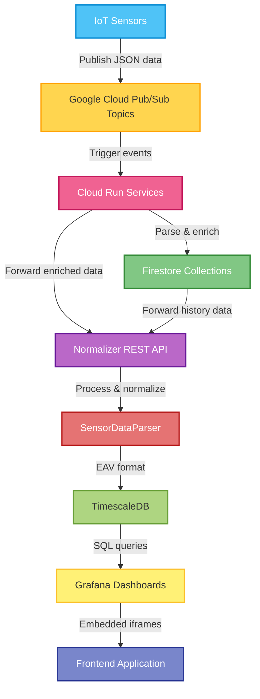

## Sensor Data Requirements and Processing

The system is designed to ingest sensor data from heterogeneous sources and normalize it into a consistent internal data model before persisting it to the database. To support flexible data formats, the ingestion pipeline applies the following validation and processing rules.

---

### Sensor Identifier Handling

Incoming data must include a sensor identifier field. The system supports multiple commonly used field name conventions.

Supported sensor ID field names:
- `sensor_id`
- `id`
- `sensorId`
- `device_id`
- `deviceId`
- `sensorID`
- `SensorID`

At least one of the supported fields must be present for the data to be accepted and processed. If no valid sensor identifier is found, the data is discarded.

---

### Metric Extraction Rules

All incoming fields are analyzed during parsing.

- Fields matching known sensor ID or timestamp fields are excluded from metric processing.
- All remaining fields are interpreted as sensor metrics.
- The field name is stored as `metric_name`.
- The field value is stored as `metric_value`.

This approach enables ingestion of dynamic and previously unknown sensor metrics without requiring schema changes.

---

### Handling List-Based Metric Values

If a metric value is a list and no explicit timestamp field is provided, the system generates timestamps automatically.

Processing rules:
- The most recent list value is assigned the ingestion timestamp (the time the data was written to Firestore).
- Each preceding value in the list is assigned a timestamp by subtracting a fixed interval.
- The interval duration is defined by the `LIST_VALUE_INTERVAL_MINUTES` constant.
- The default interval is **5 minutes**, but it can be adjusted through configuration.

This mechanism allows batch-style sensor measurements to be stored as time-series data.

---

### Timestamp Handling

The system supports multiple timestamp field name conventions.

Recognized timestamp fields:
- `timestamp`
- `time`
- `date`
- `datetime`
- `SensorReadingTime`

If a valid timestamp field is detected, its value is used as the metric timestamp.  
If no timestamp is provided, the system defaults to using the current ingestion time.

---

These rules ensure that a wide variety of sensor data formats can be ingested reliably while maintaining consistency within the time-series database.

