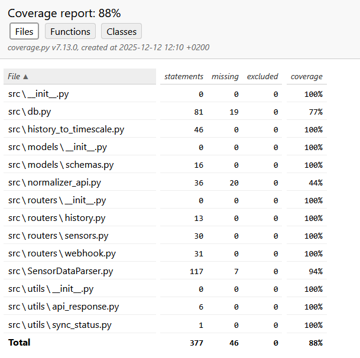

## Introduction
 This document outlines the testing procedures and results for the IoT sensor data ingestion and visualization system. The testing process aimed to ensure that all functional and non-functional requirements were met, and that the system operates reliably under various conditions.
 ## Test target and achievements
The primary targets of the testing process were to validate the following functionalities: Database working as expected, Normalizer API handles data correctly, communication between firestore and backend works smoothly. The testing process included unit tests and some integration testing.
The testing process confirmed that the database operations, including data insertion, retrieval, and querying, functioned as intended. The Normalizer API was tested to ensure it correctly processes incoming sensor data and normalizes it into the expected format before storing it in the database. Communication between Firestore and the backend was verified to ensure that data is accurately fetched and forwarded without loss or corruption.
## Testing environment
The testing was done with pytest framework for backend unit tests. A local instance of TimescaleDB was used to simulate the production database environment. Mock data representing various sensor types and readings were created to test the Normalizer API and database interactions.
The tests were executed in a controlled environment to ensure consistency and reliability of results. The testing environment included necessary dependencies and configurations to mimic the production setup as closely as possible.
# Test organization and coverage
The testing process was organized into two key areas: unit tests for individual components and simulated integration tests for component interactions. Each test case was designed to cover specific scenarios and edge cases to ensure comprehensive coverage of the system's features.
Unit tests focused on validating the functionality of the Normalizer API, including data parsing, normalization, and error handling. Integration tests simulated the end-to-end flow of data from Firestore to the backend and into the TimescaleDB database.
The overall test coverage achieved was approximately 88%, with the remaining 12% attributed to db.py engine and some lines in normalizer_api that were complex to test.
# Testing strategy
The testing strategy employed a combination of unit tests and manual integration tests. All tests were written using the pytest framework, allowing for rapid execution and easy maintenance. These tests focused on individual functions and methods within the Normalizer API and database interaction layers.
# Tested features
We tested the following files and their features:
- db.py: This file contains functions for database operations. Unit tests were created to verify that data insertion, retrieval, and querying work as expected. Mock database connections were used to isolate the tests from the actual database.
- normalizer_api.py: This file handles incoming sensor data and normalizes it. Unit tests were developed to ensure that various data formats are correctly processed and normalized. Error handling scenarios were also tested to ensure robustness.
- sensor_data_parser.py: This file is responsible for parsing sensor data into the EAV format. Unit tests were created to validate that different sensor data types are correctly parsed and transformed.
- history_to_timescale.py: This file handles the synchronization of historical data from Firestore to TimescaleDB. Integration tests were developed to simulate the end-to-end flow of data, ensuring that historical data is accurately fetched and stored in the database.
# Test cases and success criteria
The test cases were designed to cover a range of scenarios, including normal operation, edge cases, and error conditions. Each test case included specific success criteria to determine whether the functionality being tested met the expected outcomes.
Some example test cases include:
- Test Case 1: Verify that valid sensor data is correctly normalized and stored in the database.  
  Success Criteria: The data is inserted into the database with the correct format and values.
- Test Case 2: Validate that malformed sensor data is rejected and an appropriate error message is returned.  
  Success Criteria: The API returns a 400 Bad Request response with a descriptive error message.
- Test Case 3: Ensure that historical data synchronization correctly fetches data from Firestore and stores it in TimescaleDB.  
  Success Criteria: The historical data is accurately reflected in the database after synchronization.
- Test Case 4: Check that database queries return the expected results for various filter criteria.  
  Success Criteria: The query results match the expected data set based on the applied filters.

There is almost a hundred tests, so it is not feasible to list them all with their success criterias. The testing is really extensive and covers a lot of scenarios.

# Non-functional testing
There is some non-functional testing like in the endpoint /health which checks the api status but there is not much non-functional testing done in this project. Testing like that could be one of the future improvements.
# Special cases
During testing, special attention was given to edge cases such as handling malformed data and database connection failures. These scenarios were simulated to ensure that the system can gracefully handle unexpected situations without crashing or losing data.
For example, tests were created to simulate scenarios where the incoming sensor data is incomplete or contains invalid values. The Normalizer API was tested to ensure that it can identify and handle such cases appropriately, either by rejecting the data or logging an error without affecting the overall system stability.
# Attributes that cant be tested
Sensors connection to firestore and Cloud Run functions could not be tested in the current testing environment. These components rely on external services and infrastructure that were not available during the testing process. As a result, their functionality was assumed to be correct based on documentation and previous experience.
# Summary of test results
The testing process yielded positive results, with all the current test cases passing successfully. The database operations, Normalizer API functionality, and data parsing mechanisms were validated to work as intended. The simulated integration tests confirmed that data flows correctly from Firestore to the backend and into the TimescaleDB database.
The overall test coverage of approximately 88% indicates a robust testing effort, although there is room for improvement in covering the remaining untested areas such as end-to-end areas and more integration testing. Future testing efforts should focus on expanding coverage to include these areas and further validating the system's reliability and performance under various conditions.

Test coverage report here:
